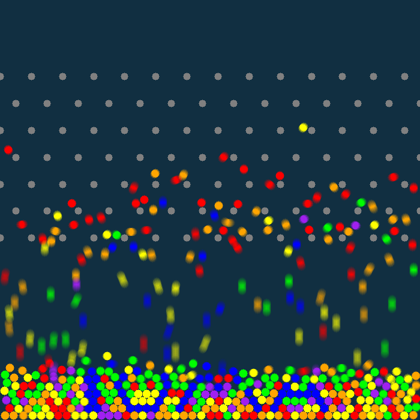

# Ball Trick

Simulation of balls falling through a Pachinko-style machine. But there seem to be something weird...




## Prerequisites

- **Operating System:** Windows 10 or later

- **Software:** Python 3.8+

- **Dependencies**: Install all the required packages using the following command

  - ```
    python -m pip install taichi, numpy, opencv-python
    ```

## Run

Firstly, run `simulation.py` to generate a physical animation. This will generate a directory `output/` and many files in it. Do not touch those files.

```
python simulation.py
```

Secondly, run `magic.py` to do the magic. **This process will take a VERY LONG time (more than a day on a 55-core machine) during which your computer might stuck. So be prepared!** Running this script will generate some more files under `output/`.

```
python magic.py
```

At last, run `generate_video.py` and see the magic works! This process will apply the visual control to the physical animation, and generate a video named `magic.mp4`, which is the result.

```
python generate_video.py
```

**Please do not touch anything in the  `output/` directory when running!**
